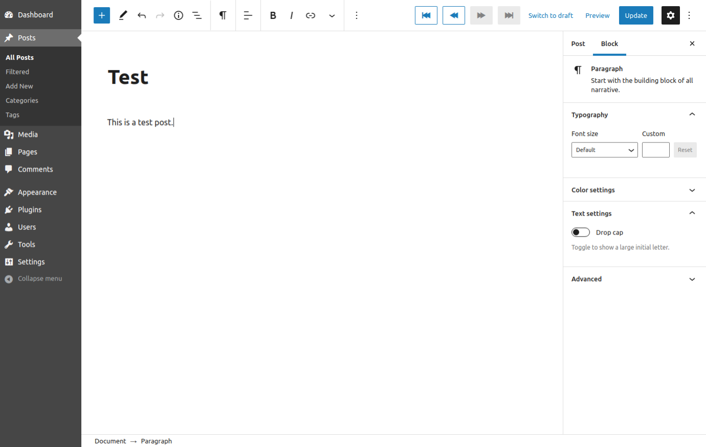
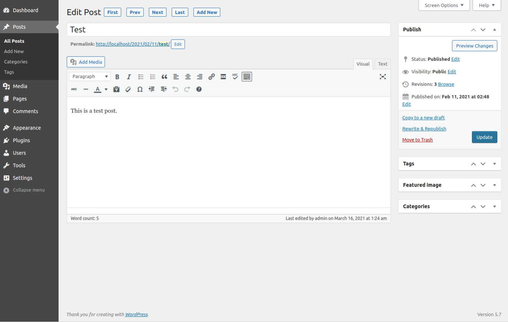

# Smart Prev Next #
**Contributors:** [gregross](https://profiles.wordpress.org/gregross/)  
**Plugin URI:** http://toolstack.com/smart-prev-next  
**Author URI:** http://toolstack.com  
**Tags:** admin editor prev next  
**Requires at least:** 3.5  
**Tested up to:** 6.7  
**Requires PHP:** 7.0  
**Stable tag:** 1.5  
**License:** GPLv2  

Smart Previous Next - Adds smart previous/next buttons to the editor, supports both Classic and Gutenberg!

## Description ##

WordPress is missing any kind of Previous/Next buttons in the editor, there are several other plugins that add them, but Smart Previous Next has advanced features that they are missing.

- Supports both the Classic and Gutenberg editors.
- Used any filter, search or sort options you have set in the pages/posts list and moves to the previous/next post based on that.
- Includes first/last buttons (which also support filter/search/sort)
- Adds a new item under the pages/posts admin menu to allow you to return to your previous filter/search/sort with one click

This code is released under the GPL v2, see license.txt for details.

## Installation ##

1. Extract the archive file into your plugins directory in the smart-prev-next folder.
2. Activate the plugin in the Plugin options.
3. Go editing!

## Frequently Asked Questions ##

### Are other sort features added by other plugins supported? ###

No, if you have another plugin that adds columns or features to the page/post list, including custom sort orders, they are not used as part of this plugin.

## Screenshots ##

### 1. Gutenberg Editor. ###

### 2. Classic Editor. ###

## Changelog ##
### 1.5 ###
* Release date: November 12, 2024
* More fixes for WP 6.7.

### 1.4 ###
* Release date: November 12, 2024
* Add support for WP 6.7.

### 1.3 ###
* Release date: July 23, 2024
* Add support for WP 6.1.

### 1.2 ###
* Release date: July 23, 2024
* Failed deployment, see version 1.3.

### 1.1 ###
* Release date: August 31, 2021.
* Fixed duplicate parameters being added.
* Fixed incomplete WP_Query results on large results list.
* Fixed default "all" post types logic check.

### 1.0 ###
* Release date: March 18, 2021
* Initial release.

## Upgrade Notice ##
None at this time.

## Roadmap ##

* None at this time!
